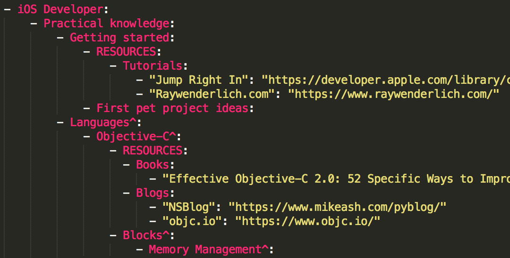

## How to add new topics or materials

#### One file to rule them all

### How to add topics and materials

1. Open `RoadmapProject/Script/Content.yml` in your fork repository 
1. Add topics and/or links to materials
1. Commit and push `Content.yml` changes to Github 
2. Submit a pull request

#### When your changes will be applied

1. Wait for your pull request to be merged
1. Wait up to 5 minutes for Travis CI to regenerate roadmap images and text version

#### Prerequisites for adding topics and materials

1. Git
1. Fork of the repository
2. YAML editor, e.g. [Sublime Text](https://www.sublimetext.com/).

### How to run generation script locally (Optional)
The generation script will generate images and the text version of the roadmap.

1. run `./generateAll.sh`

**or**

1. Go to `RoadmapProject/Script`
2. Run `./main.swift`

##### Prerequisites for running the script locally

1. Latest Swift/Xcode
1. Prepare PlantUML:
	1. Install [JDK](http://www.oracle.com/technetwork/java/javase/downloads/jdk9-downloads-3848520.html)
	1. Install Homebrew:
		- `/usr/bin/ruby -e "$(curl -fsSL https://raw.githubusercontent.com/Homebrew/install/master/install)"`
	1. Install GraphViz:
		- `brew install libtool`
		- `brew link libtool`
		- `brew install graphviz`
		- `brew link --overwrite graphviz`
	1. Go to `Roadmap Project/Script/` 
	1. Run `java -jar plantuml.jar -testdot` to check if installed correctly.

##### How to debug script (Optional)
Use `Roadmap Project/Roadmap.xcodeproj` to run and debug script.

Xcode runs and debugs an executable binary, thus generated output will be put next to the binary.

Always run script via terminal before submitting a PR.
