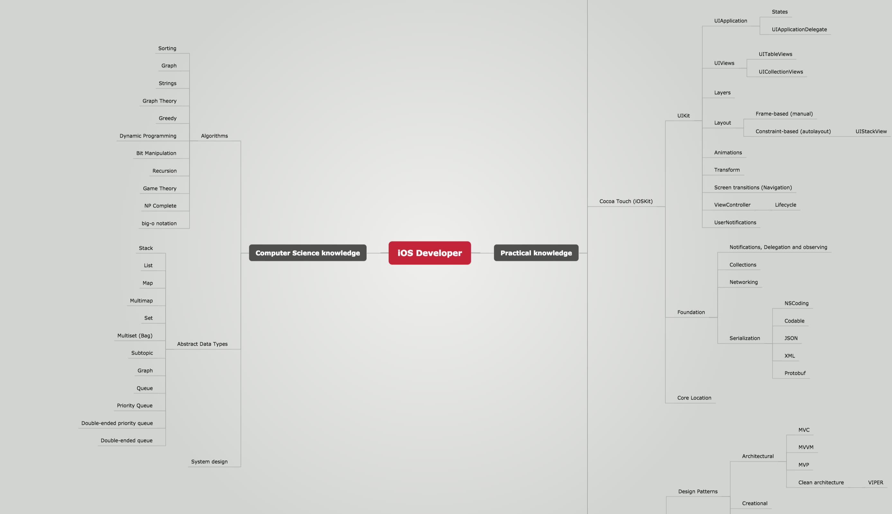

# iOS Developer-Roadmap
Roadmap to becoming an iOS developer in 2018
## Is it for you?
The roadmap will be helpul for:

- anyone who wants to become an iOS developer
- iOS developers who want to become experts
- iOS developers who are preparing for interviews and need to brush up knowledge
- iOS developers who want to compile own set of interview questions

## Why this topics?
See this article (COMING SOON) explainig selection of topics.

## How to use this roadmap
1. Find a topic you want to study.
2. Go to corresponding resources section.
3. Study untill you can confidently explain the topic to your cat.
4. (Optional) tick the checkbox next to the topic. [How to tick a checkbox](Resources/HOWTOCHECKBOX.md).
4. Go to step 1.

`Essential topics` are topics which significantly contributes to understanding of iOS development. Consequently, it is a good idea to study them first as they are often encountered on interviews.

Start from `Getting started` section if you haven't done any iOS development yet.

## Resources
Use materials from [Resources](Resources/RESOURCES.md) section to master topics from the Roadmap.

## The roadmap

- [ ] Practical knowledge
	- [ ] Getting started
		- [ ] First pet project ideas
	- [ ] Languages
		- [ ] `Objective-C`
			- [ ] `Blocks`
				- [ ] `Memory Management`
			- [ ] `KVC`
			- [ ] `KVO`
			- [ ] Toll-free bridging
			- [ ] `Runtime`
				- [ ] `Method messaging`
				- [ ] Swizling
				- [ ] NSZombies and KVO
implementation
		- [ ] `Swift`
			- [ ] `Closures`
			- [ ] `Initializers`
			- [ ] `Generics`
			- [ ] `Protocols`
			- [ ] `Structs`
			- [ ] `Enums`
			- [ ] `Runtime`
				- [ ] `Method dispatch`
		- [ ] `Memory management`
			- [ ] `Stack and Heap`
			- [ ] `Value vs Reference type`
			- [ ] `MRC`
			- [ ] `ARC`
				- [ ] `weak references`
			- [ ] `Retain cycles`
			- [ ] Garbage collector
			- [ ] `Memory leaks`
			- [ ] Shallow and deep copying
			- [ ] `Autorelease pool`
		- [ ] `Multithreading and concurency`
			- [ ] POSIX threads
			- [ ] NSThreads
			- [ ] Perform selector family
			- [ ] `GCD`
			- [ ] `NSOperation(Queue)`
			- [ ] `Runloop`
			- [ ] `Methods of thread synchronisation`
			- [ ] Problems
				- [ ] Race condition
				- [ ] Deadlock
				- [ ] Reader-writer problems
		- [ ] `Cocoa Touch (iOSKit)`
			- [ ] `UIKit`
				- [ ] `UIApplication`
					- [ ] `States`
					- [ ] `UIApplicationDelegate`
				- [ ] `UIViews`
					- [ ] `UITableViews`
					- [ ] `UICollectionViews`
				- [ ] Layers
				- [ ] `Layout`
					- [ ] `Frame-based (manual)`
					- [ ] `Constraint-based (autolayout)`
						- [ ] UIStackView
				- [ ] `Animations`
				- [ ] `Transform`
				- [ ] `Screen transitions (Navigation)`
				- [ ] `ViewController`
					- [ ] `Lifecycle`
				- [ ] UserNotifications
			- [ ] `Foundation`
				- [ ] `Notifications, Delegation and observing`
				- [ ] Collections
				- [ ] `Networking`
				- [ ] `Serialization`
					- [ ] NSCoding
					- [ ] `Codable`
					- [ ] `JSON`
					- [ ] XML
					- [ ] Protobuf
			- [ ] Core Location
			- [ ] `Work in background mode`
		- [ ] `Software Architecture`
			- [ ] `Design Patterns`
				- [ ] `Architectural`
					- [ ] `MVC`
					- [ ] `MVVM`
					- [ ] `MVP`
					- [ ] `Clean architecture`
						- [ ] `VIPER`
						- [ ] RIBs
				- [ ] `Creational`
					- [ ] `Singleton`
					- [ ] `Factory`
					- [ ] `Abstract Factory`
				- [ ] Structural
				- [ ] `Behavioural`
					- [ ] `Observer`
				- [ ] Concurrency
			- [ ] `Design Principles`
				- [ ] `SOLID`
				- [ ] `Inversion of Control`
					- [ ] `Dependency Injection`
					- [ ] Service Locator
			- [ ] Object-Oriented Programming
			- [ ] `Third-party dependencies management`
				- [ ] `Cocoapods`
				- [ ] `Carthage`
				- [ ] Swift Package Manager
			- [ ] Functional programming
				- [ ] Functional Reactive Programming Frameworks
		- [ ] Project structure and File/Group organisation
		- [ ] `Version Control Systems`
			- [ ] `Git`
		- [ ] Debugging
			- [ ] Instruments
			- [ ] Best practices
				- [ ] Checklists
		- [ ] UX
		- [ ] `Caching and Persistency`
			- [ ] `Core Data`
			- [ ] Realm
			- [ ] YAPDatabase
		- [ ] `Testing`
			- [ ] `Unit Tests`
			- [ ] Snapshot Tests
			- [ ] Functional test
			- [ ] TDD
			- [ ] BDD
		- [ ] Performance optimization
			- [ ] Increase FPS
			- [ ] Decrease memory footprint
		- [ ] Code signing
		- [ ] Tools
			- [ ] `Swiftlint`
			- [ ] Sourcery
			- [ ] Fastlane
		- [ ] Continuous Integration
		- [ ] Security
			- [ ] Keychain
		- [ ] tvOS
		- [ ] WatchKit
- [ ] Computer Science knowledge
	- [ ] `Algorithms`
		- [ ] `Sorting`
		- [ ] `Graph Theory`
			- [ ] ` Trees`
		- [ ] `Strings`
		- [ ] Greedy
		- [ ] Dynamic Programming
		- [ ] Bit Manipulation
		- [ ] `Recursion`
		- [ ] Game Theory
		- [ ] NP Complete
		- [ ] `Big-O notation`
	- [ ] `Abstract Data Types`
		- [ ] `Stack`
		- [ ] `Array`
		- [ ] `List`
		- [ ] `Map`
		- [ ] Multimap
		- [ ] `Set`
		- [ ] Multiset (Bag)
		- [ ] `Graph`
		- [ ] `Queue`
		- [ ] Priority Queue
		- [ ] Double-ended priority queue
		- [ ] Double-ended queue
	- [ ] `System design`
		- [ ] Problems

## How to contribute
Submit a pull request with additional topics and/or study matterials or throw ideas at me on Twitter 

## License

