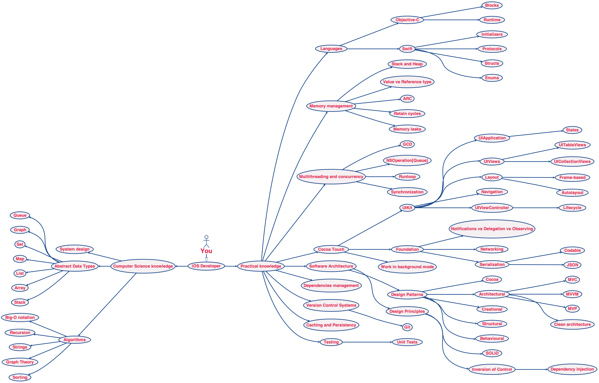

# 🚀 iOS Developer Roadmap 
Roadmap to becoming an iOS developer in 2020.

## ☝️ What is it?
This is a tree-like compilation of topics highly relevant to iOS development. Both image and text version are generated from human readable content file.

## ✌️ Who is it for?
The roadmap will be helpul for:

- anyone who wants to become an iOS developer
- iOS developers who desire to become experts
- iOS developers who are preparing for interviews and need to brush up knowledge
- iOS developers who need to compile own set of interview questions

## 👌 Why these topics?
See [this article](https://medium.com/@borlov/c9a24f413457) explaining selection of topics.

## 👨‍🎓 How to use this roadmap
1. Find a topic you want to study.
2. Go to corresponding resources section.
3. Study until you can confidently explain the topic to your cat.
4. (Optional) tick the checkbox next to the topic. [How to tick a checkbox](HowTo/HOWTOCHECKBOX.md).
4. Go to step 1.

`Essential topics` are topics which significantly contribute to understanding of iOS development. Consequently, it is a good idea to study them first as they are often encountered on interviews.

Start from `Getting started` section if you haven't done any iOS development yet.

## 🗺 Image version 
Roadmap of essential topics. Roadmap for all topics is [here.](RoadmapProject/Script/Generated/ROADMAP.png)

## 📝 Text version
[Text version with materials to study.](RoadmapProject/Script/Generated/ROADMAP.md)

## 🤝 How to contribute

- add new topics to `Content.yml`
- add missing study materials to `Content.yml`
- throw ideas at me on 

[The complete contribution guide.](HowTo/HOWTOPR.md)

## ☑️ TODO
- [x] content file with topics and materials
- [x] ability to generate README.md from the content file
- [x] ability to generate Roadmap tree image from the content file
- [ ] make generation script less miserable:
	- [x] make it readable 🤦
	- [ ] output Yaml format violation errors
	- [ ] handle errors of parsing Yaml into Topics and Resources
	- [ ] handle file read/write errors
	- [ ] handle image generation errors
- [x] automatic regeneration of roadmap after every commit
- [ ] automatic validation of content format on PR
- [ ] make sure Travis doesn't deploy if generation script fails

## ⚙️ Generation status

## 📃 License

## 📊 Skills Matrix 
You might also like the [iOS Developer Skills Matrix](https://github.com/BohdanOrlov/ios-skills-matrix).

## 📚 iOS and Swift Tutorials and Courses

Learn iOS development & Swift online from the best iOS Swift tutorials and courses recommended by the programming community. 
https://hackr.io/tutorials/learn-ios-swift
